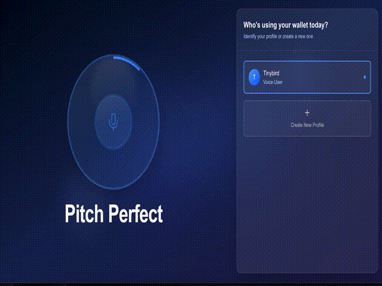

# Pitch Perfect

Pitch Perfect is a voice-controlled AI assistant for Ethereum wallet management. Using the wake phrase **"Hey Beca, listen up,"** users can securely manage their wallets with natural voice commands. The system requires speaker identification before processing any wallet actions, improving trust, UX and personalization.

Key features include:

- **Voice-activated wallet management** with mandatory speaker identification
- **Wake phrase**: "Hey Beca, listen up"
- **Frontend-driven voice registration** for secure profile creation
- **Transcription and command processing** via LLM and ElizaOS Agent
- **Conversation memory** for contextual 

---

## 🧠 System Architecture

| Component          | Description                                                                                        | Key Actions/Endpoints                                                                       | How It Relates to Others                                                           |
| ------------------ | -------------------------------------------------------------------------------------------------- | ------------------------------------------------------------------------------------------- | ---------------------------------------------------------------------------------- |
| **Agent (Beca)**   | The core AI orchestrator. Listens for user messages, manages plugins, and handles session context. | - Orchestrates plugin actions - Listens for registration, wallet, and transaction events | Coordinates all plugin actions and session state                                   |
| **Voice Plugin**   | Handles voice registration and speaker identification.                                             | - `REGISTER_VOICE` - `IDENTIFY_VOICE`                                                    | On successful registration, triggers wallet creation                               |
| **Wallet Plugin**  | Manages wallet creation, retrieval, and transaction sending via Privy.                             | - `createWallet` - `getWallet` - `sendTransaction`                                    | Wallet is created after voice registration; Broadcasts transaction from the Server |
| **CCIP Plugin**    | Prepares and tracks cross-chain (CCIP) transactions.                                               | - `prepareCCIPTransaction` - `trackCCIPStatus`                                           | Used for cross-chain flows; works with wallet plugin                               |
| **Frontend**       | Handles audio capture, registration UI, and session management.                                    | - Sends audio for registration - Receives agent responses - Confirms transactions     | Initiates registration and transaction flows                                       |
| **Session/Memory** | Stores conversation and profile context for each user.                                             | - Tracks user profiles - Stores wallet addresses - Maintains session state            | Used by agent and plugins for context                                              |

---

## 🔗 Plugin Orchestration Flow

1. **Voice Registration**  
   - User registers voice via frontend.
   - Voice plugin processes registration and, on success, agent triggers wallet creation via wallet plugin.
   - Wallet address is attached to the user profile.

2. **Speaker Identification**  
   - On every new session or sensitive command, agent requires speaker identification via the voice plugin.

3. **Wallet Actions**  
   - After identification, user can request wallet info, insights or intiate transactions.
   - For EVM transactions, wallet and uses Privy API to send on any supported chain (via CAIP2 chain ID) and ccip plugin and pitch-perfect contract forward assets to other chains

4. **Cross-Chain (CCIP) Actions**  
   - For cross-chain requests, CCIP plugin prepares the transaction to be routed via the pitch-perfect `sender contract`.
   - After user confirmation, wallet plugin sends the transaction.

---

## 📦 Deployed Contracts

| Network      | Contract Address                             |
| ------------ | -------------------------------------------- |
| Sepolia      | `0x25C2834670B5adF9C5D79D143a19db959CCF0a85` |
| Base Sepolia | `0xfD2df61f7Fc1e6B1A645fBB451c135048D9c3dBa` |

---

## 🛠️ Supported EVM Chains

Pitch Perfect supports sending transactions from any EVM-compatible chain supported by Privy, to other EVM chains and Solana with the help of chainlink's CCIP.

---

## 🚀 Try It Out

- [Live Demo](https://pitch-perfect-eliza.vercel.app/)
- Register your voice (create a wallet)
- Use the wake phrase: **"Hey Beca, listen up"**
- Add new contacts, and Send transactions across multiple chains!

